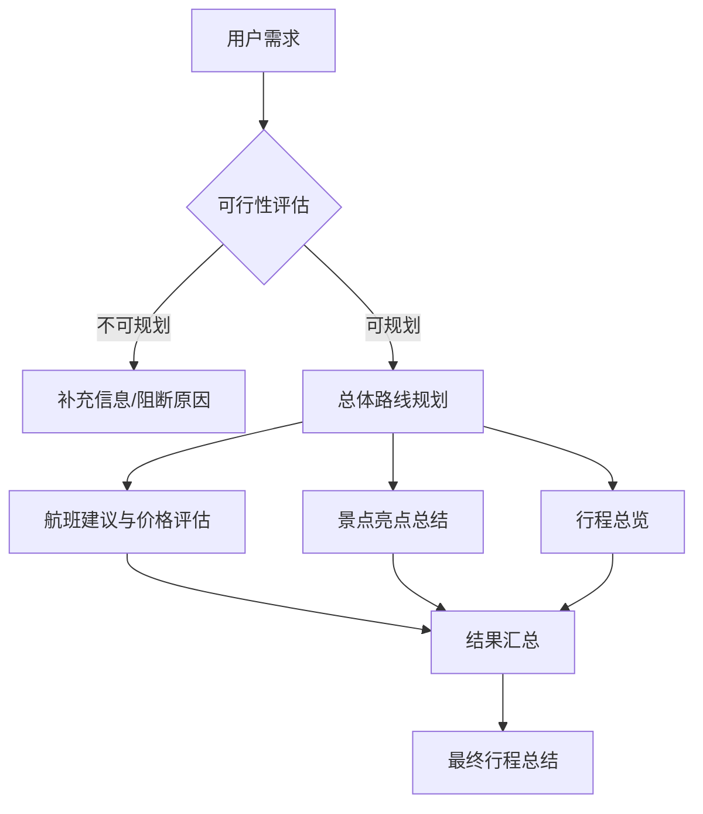

# Go项目推荐：AI 旅行规划服务平台（GopherAI）

GopherAI 是一个基于 Go + Vue3 的 AI 旅行规划服务平台，聚合了多会话聊天、图像识别、流式输出等典型 AI 能力，并内置旅行路线规划工作流，配套 MySQL / Redis / RabbitMQ 等基础设施，可直接作为全栈示例或生产级骨架使用。

## 🚀 核心特性

- **多会话 AI 助手**：Gin + GORM + Redis 维护用户上下文，RabbitMQ 异步写入历史消息，前端通过 SSE 实时接收回复。
- **图像识别链路**：提供图片上传、预处理、ONNXRuntime 推理到分类标签输出的全流程代码，便于扩展更多视觉模型。
- **旅游规划能力**：基于 Graph 编排 AI 能力，按需求完整度分流到不同 Agent，并结合 Agent + MCP 工具调用完成路线建议与可行性补全。
- **Google 搜索工具链**：在请求体中指定 `usingGoogle=true`，Qwen-Plus 会借助 CloudWeGo EinO ToolNode 调用 Google Custom Search API，把最新网页结果注入上下文后生成回答。
- **VikingDB RAG 检索**：设置 `usingRAG=true` 时，服务会利用火山引擎 VikingDB Retriever 召回业务知识库，在回答里追加“参考资料”段落，保证可追溯性。
- **流式推理与消息落库**：支持会话首次创建与既有会话触发 SSE 流式回答，消息借助 RabbitMQ 异步入库，保证高并发下的实时体验与可靠性。
- **会话热启动管理**：服务启动时自动从 MySQL 预载会话/消息到内存态 AIHelper 管理器，支持历史会话秒级恢复和多模型策略。
- **高并发友好架构**：通用中间件（日志、认证、限流）、RabbitMQ 解耦写入、Redis 缓存加速，确保响应速度和扩展能力。
- **AI 工厂模式**：统一的 Provider 接入模式，便于新增不同类型的模型或第三方服务。
- **全栈实现**：Vue3 + Element Plus 构建的管理面板覆盖登录注册、验证码校验、聊天与图像识别等场景。

## 🧭 旅游规划助手（Agent 编排）

项目内置基于编排 Agent 的旅游规划助手，面向真实旅行需求进行分工协作与结果整合：

- **可行性评估与补全**：先判断行程是否可规划，给出阻断原因与补充信息清单。
- **总体路线规划**：产出城市顺序、交通方式与节奏建议，确保行程逻辑可落地。
- **航班建议与价格评估**：结合 MCP 工具查询航班信息，输出机票选择与价格区间判断。
- **景点亮点总结**：补充目的地关键景点与体验，增强可执行性与可玩性。
- **统一摘要输出**：将多 Agent 结果汇总成清晰可读的行程总结。

架构示意（Mermaid）：



## 🧠 外部 AI 能力与第三方服务

| 能力 | 使用场景 | 配置入口 | 说明 |
| --- | --- | --- | --- |
| Qwen-Plus（灵积 DashScope OpenAI 兼容接口） | 主聊天模型（`modelType=1`），支持 Google / RAG 工具调用 | `config/env.sh` → `OPENAI_API_KEY` / `OPENAI_BASE_URL_ALIYUN` / `OPENAI_MODEL_NAME` | 默认模型为 `qwen-plus`，通过 CloudWeGo EinO 对接 OpenAI Chat API 兼容层。 |
| Qwen3-VL-Plus | 图片理解 / 多模态问答 | `config/config.toml` → `[imageAIConfig]` | 依托 DashScope 兼容接口的多模态模型，`common/image` 已封装图片转 base64 的推理链路。 |
| 火山引擎 VikingDB 向量数据库 | RAG 知识检索工具 | `config/config.toml` → `[vikingDBConfig]` | `common/tools` 中使用 AK/SK 构建 `Retriever`，`usingRAG=true` 时在回答中附带“参考资料”引用。 |
| Google Custom Search JSON API | 外部实时搜索 | `config/config.toml` → `[googleConfig]` | 通过 CloudWeGo EinO ToolNode 暴露给 Qwen-Plus，开启 `usingGoogle=true` 后自动调用并将结果回注上下文。 |

## 🧱 技术栈

- **后端**：Go 1.20+、Gin、GORM、RabbitMQ、Redis、MySQL、ONNXRuntime
- **前端**：Vue3、Vue Router、Element Plus、Axios
- **基础设施**：MySQL 8、Redis 6、RabbitMQ 3、Nginx（可选）

## 🗺 系统架构


> 架构图覆盖 Web 层、业务服务、AI 推理、消息队列与数据层，展示了从请求进入、AI 处理到结果落库和前端展示的完整链路。

## 📡 端口总览

| 模块 | 端口 | 说明 | 来源 |
| --- | --- | --- | --- |
| Go 后端服务 | `9090` | Gin API / SSE 服务入口 | `config/config.toml` → `[mainConfig] port` |
| Vue 前端 DevServer | `8080` | `vue-cli-service serve` 默认访问地址 | `vue-frontend/vue.config.js` |
| MySQL | `3307` | 主业务数据库 `GopherAI` | `config/config.toml` → `[mysqlConfig] port` |
| Redis | `6380` | 验证码、缓存等 | `config/config.toml` → `[redisConfig] port` |
| Redis Vector (Redis Stack) | `6381` | RAG 向量检索存储 | `common/rag/redis_docker_init.sh` |
| Redis Stack UI | `8002` | Redis Stack Web UI | `common/rag/redis_docker_init.sh` |
| RabbitMQ | `5672` | 异步消息/任务队列 | `config/config.toml` → `[rabbitmqConfig] port` |
| MCP 工具服务 | `8081` | SSE 工具服务，URL: `http://localhost:8081/sse` | `common/aihelper/medicalAgent.go` → `myBaseURL` |
| MCP Flight 工具服务 | `8082` | Google Flights 查询工具，URL: `http://localhost:8082/sse` | `common/aihelper/medicalAgent.go` → `flightBaseURL` |

## 📁 主要目录

- `common/`：数据库、Redis、RabbitMQ 等通用客户端初始化
- `controller/`、`router/`：HTTP API、SSE 推送接口
- `service/`、`dao/`：业务逻辑与数据访问
- `vue-frontend/`：Vue3 前端代码
- `config/`：TOML 配置和运行所需脚本

## ⚙️ 环境与配置

1. 参考 `config/config.sample.toml` 复制为 `config/config.toml`，再根据实际环境补齐数据库、Redis、RabbitMQ、邮件、Google、VikingDB、ImageAI 等配置。
2. 在 `config/env.sh` 中写入 DashScope（Qwen-Plus）兼容接口所需的 `OPENAI_API_KEY`、`OPENAI_BASE_URL_ALIYUN`、`OPENAI_MODEL_NAME`，运行前执行 `source config/env.sh`。
3. 如果需要本地 ONNX 推理，确保安装 ONNXRuntime 依赖，并设置 `config/env.sh` 中的 `LD_LIBRARY_PATH`。
4. 保证上表列出的端口未被占用，或在配置文件中调整后同步更新 README。

## 🧠 RAG Redis 向量数据库

RAG 数据库功能基于 Redis Stack（支持向量索引），用于存储与检索向量化数据。请分别执行以下两步：先启动容器，再在 Redis CLI 中创建向量索引。

1) 启动 Redis Stack 容器（终端执行）：

```bash
docker run -d \
  --name redis-vector-6381 \
  -p 6381:6379 \
  -p 8002:8001 \
  redis/redis-stack:latest
```

2) 创建向量索引（Redis CLI 中执行）：

```bash
FT.CREATE idx:rag_data ON HASH PREFIX 1 rag:data: SCHEMA content TEXT embedding VECTOR HNSW 6 TYPE FLOAT32 DIM 768 DISTANCE_METRIC COSINE
```

## 🛠 能力开关示例

聊天接口统一支持以下 JSON 字段：

```json
{
  "question": "从上海出发 5 天游成都，喜欢美食和慢节奏",
  "modelType": "1",
  "sessionId": "xxxx",        // 新会话可省略
  "usingGoogle": true,        // 调用 Google Search Tool
  "usingRAG": true            // 触发 VikingDB 检索并追加参考资料
}
```

- `POST /chat/send-new-session` / `/chat/send`：同步回答。
- `POST /chat/send-stream-new-session` / `/chat/send-stream`：通过 SSE 推送增量 token，并在结尾发送 `[DONE]`。
- 所有消息会先写入内存态 AIHelper，再异步投递到 `Message` 队列持久化到 MySQL。

## 🚀 快速开始

```bash
# 1. 初始化依赖
go mod download

# 2. 启动后端
go run main.go
```

## 🧰 启动 MCP 工具服务

默认 MCP SSE 服务地址为 `http://localhost:8081/sse`。

```bash
cd common/tools/mcp/eino-mcp/tools/mcp-time
go build -o mcp-time main.go
./mcp-time -transport=sse -server_listen=localhost:8081
```

Google Flights MCP 工具服务（基于 SerpAPI）：

```bash
export SERPAPI_API_KEY=your_api_key
cd common/tools/mcp/eino-mcp/tools/mcp-flight
go build -o mcp-flight main.go
./mcp-flight -transport=sse -server_listen=localhost:8082
```

MCP 工具服务相关环境变量：

- `GOOGLE_API_KEY`：Google Search 工具（`mcp-time` 内的 `google_search`）所需 API Key
- `GOOGLE_SEARCH_ENGINE_ID`：Google Search 工具（`mcp-time` 内的 `google_search`）所需自定义搜索引擎 ID
- `SERPAPI_API_KEY`：Google Flights 工具（`mcp-flight`）所需的 SerpAPI Key

前端：

```bash
cd vue-frontend
npm install
npm run serve
```

确保 MySQL、Redis、RabbitMQ 已启动并与配置文件保持一致。

## 🙏 致谢

- 感谢 Codex 的大力支持，协助我们快速完善文档与代码细节。
